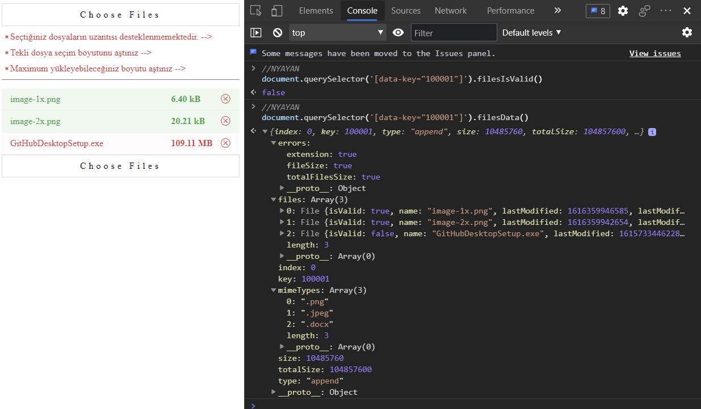

### Note : (1MB - 1048576 byte)
<br/>

#### File Upload Plugin Object

```javascript
NY = { FilePlugin: { config: { icons: {}, messages: {} }, files: [] } };
```

<br/>

#### Input properties

```javascript
// --> Selected Type
data-type="append" // All time append files
data-type="select" // Clear before append files

// --> Validation
data-size // Single File Size Validation
data-total-size="104857600" // Total Selected File Size Validation
accept=".png,.jpeg,.docx" // Selected Files Extension Validation

// --> Validation Color
danger // Invalid
success // Valid

// --> Validation Messages
data-file-size-error-message // Single File Size Validation Error Message
data-total-size-error-message // Total Selected File Size Validation Error Message
data-extension-error-message // Selected Files Extension Validation Message

// --> Default Validation Messages
fileSizeErrorMessage: "Tekli dosya seçim boyutunu aştınız"
totalSizeErrorMessage: "Maximum yükleyebileceğiniz boyutu aştınız"
 extensionErrorMessage: "Seçtiğiniz dosyaların uzantısı desteklenmemektedir."

// --> Example Usage
// 1
<input type="file" name="file" id="file1" class="ny-file" data-type="append" data-size="10485760" data-total-size="104857600" accept=".png,.jpeg,.docx" data-file-size-error-message="A" data-total-size-error-message="B" data-extension-error-message="C" multiple/>
// 2
<input type="file" name="file" id="file2" class="ny-file" data-type="selected" multiple/>
// 3
<input type="file" name="file" id="file3" class="ny-file" data-type="selected" accept=".png,.jpeg,.docx" multiple/>
```
<br/>

#### Input Functions
```javascript
document.querySelector('#file1').filesIsValid() // true | false
document.querySelector('#file1').filesData() // input selected all data

```
<br/>

## Files Data


<br/>

## Files Is Valid


<br/>

## All

